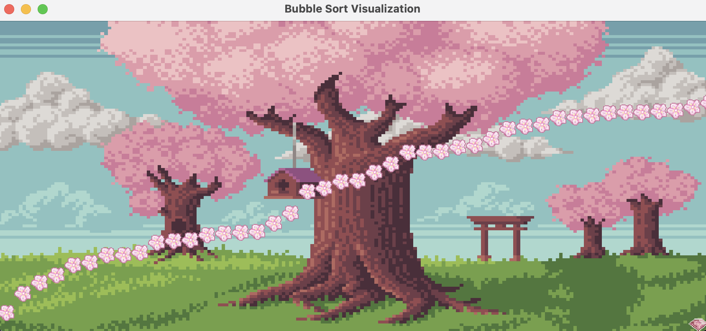

# 🌸 Bubblesort Visualization in Java Swing 🌸

This project is a visual representation of the **Bubble Sort** algorithm using **Java Swing**. It provides an interactive, step-by-step visualization of how the Bubble Sort algorithm works, allowing users to see the elements being swapped as the algorithm progresses.

## Features

- **Visual Animation**: The sorting process is displayed through animated bar-like elements that represent numbers.
- **Custom Pixel Art**: Icons used in the UI are custom-made using pixel art, created by the me.

## How it Works

Bubble Sort is a simple sorting algorithm that compares adjacent elements in a list and swaps them if they are in the wrong order. This process is repeated until the list is sorted.

1. The algorithm iterates through the list multiple times.
2. On each pass, it compares each pair of adjacent elements.
3. If a pair is in the wrong order, the algorithm swaps them.
4. This process continues until no swaps are needed, meaning the list is sorted.

The visualization helps users understand how Bubble Sort works by showing how elements move in each pass.

## Requirements

- Java 8 or higher
- IDE or command line with Java support (e.g., IntelliJ IDEA, Eclipse, or terminal)

## Installation

1. Clone the repository to your local machine:
   ```bash
   git clone https://github.com/yourusername/bubblesortvisualisation.git
   ```
2. Navigate to the project folder and open it in your preferred IDE.

3. Run the `BubblesortVisualizer.java` file to start the visualization.

## Screenshots

Here’s how the visualization looks (sorted):

 

```
